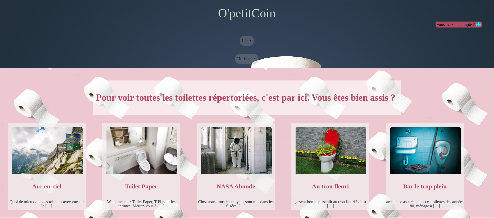
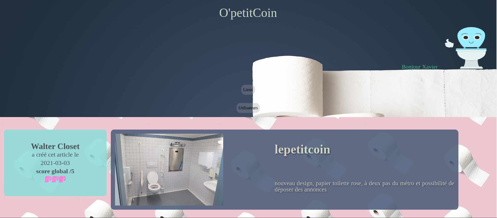
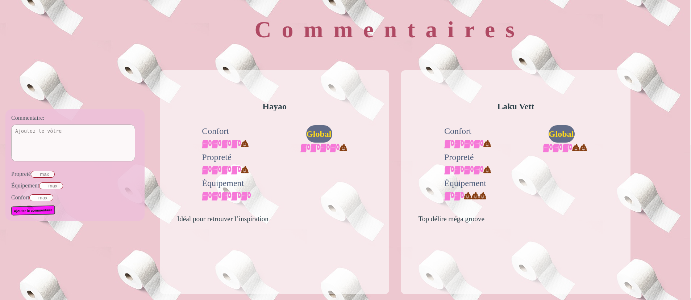
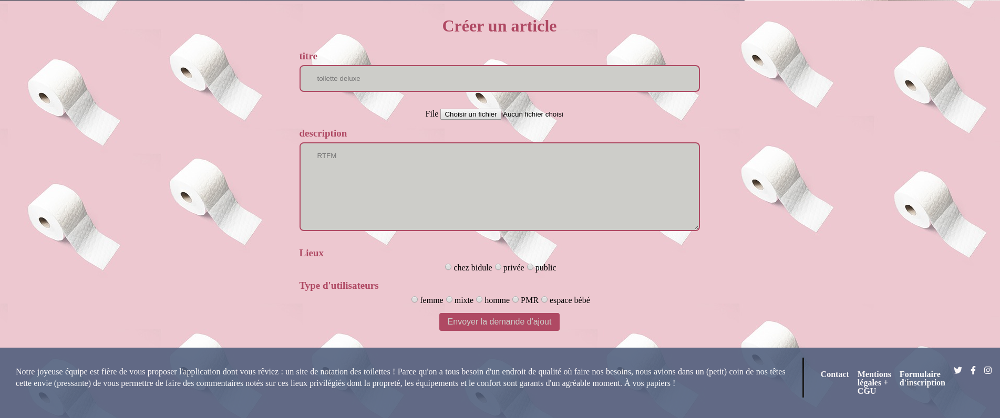

# Projet OpetitCoin
site de notation de toilettes réalisé en février 2021 par Cécilia, Franck, Quentin et Xavier

## Visuels
### page d'accueil

### page article - descriptif

le score global est calculé à partir des notes des commentaires (ceux-ci apparaissent sous le descriptif des toilettes)

### page article - descriptif

le score global d'un commentaire est calculé à partir de 3 notes : propreté, confort, équipement

### page création d'un article
