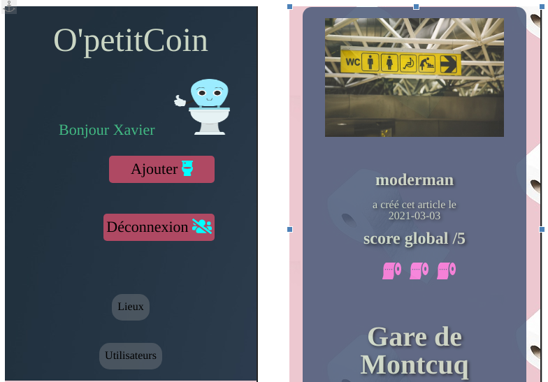
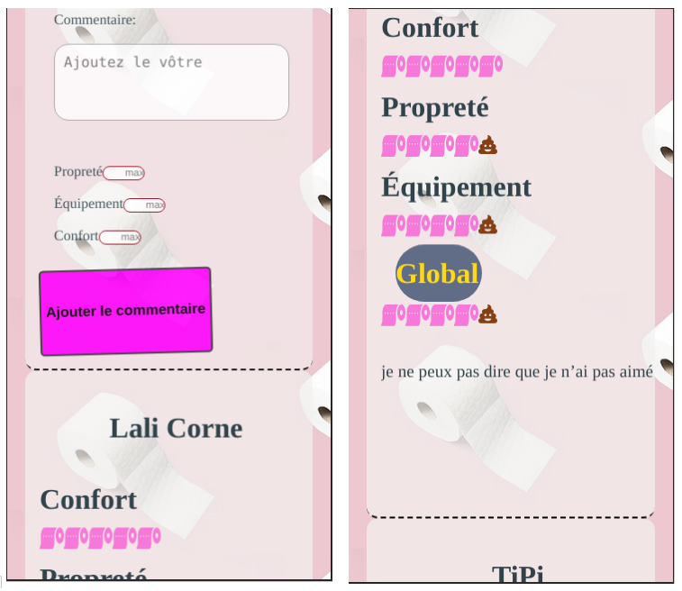

# Projet OpetitCoin
site de notation de toilettes réalisé en février 2021 par Cécilia, Franck, Quentin et Xavier.

Cette application permet à un visiteur de consulter les avis sur des toilettes et à un utilisateur de pouvoir commenter et noter des toilettes selon trois critères: la propreté, le confort et les équipements.

### backend: Wordpress API Rest
création d'un plugin (architecture en POO et PSR-4) :
- 'post type' Toilette
- taxonomies ajoutées au 'post'
- nouveaux champs sur les objets avec la fonction 'register_rest_field()'
- nouveaux rôles lors de la création de compte
- attribution des 'capabilities' à chaque rôle
- 
utilisation de plugins :
- Query Monitor : outil de développement et de débogage
- WP REST User : enregistrement de l'utilisateur et récupération de mot de passe si oubli
- JWT Auth : authentification des requêtes des utilisateurs via des 'token'

### frontend: Vue.js et Sass
utilisation d'Axios pour afficher et utiliser les données du back avec Vue.js

'AuthenticationService':
- création d'un utilisateur via le formulaire
- récupération du 'token' lors de la connexion d'un utilisateur

'ToiletteService' :
- création d'un article 'Toilette' via un formulaire par un utilisateur connecté
- récupération d'une image lors de la création d'un article

'CommentService' :
- création d'un commentaire sur article 'Toilette' via un formulaire par un utilisateur connecté

Création de fonctions et conditions permattant le calcul et l'affichage des scores d'un commentaire puis de la moyenne de l'ensemble des commentaires liés à un article

## Visuels
### page d'accueil

### page article - descriptif

le score global est calculé à partir des notes des commentaires (ceux-ci apparaissent sous le descriptif des toilettes)

### page article - commentaires

le score global d'un commentaire est calculé à partir de 3 notes : propreté, confort, équipement

### page création d'un article

### responsive

